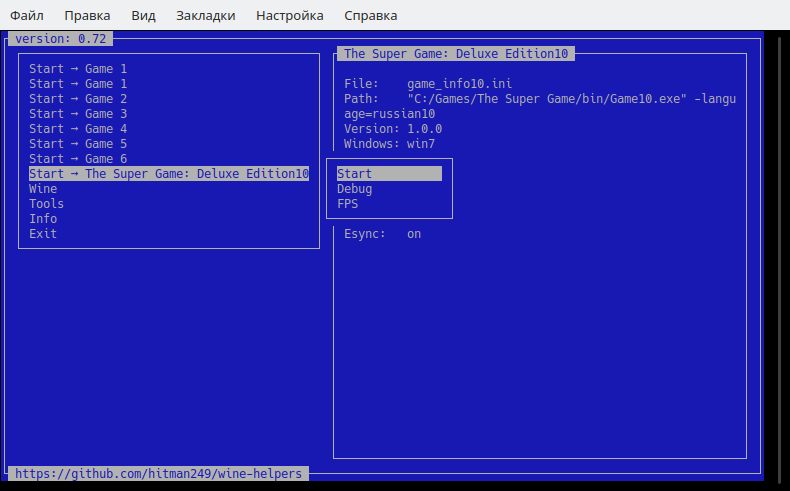
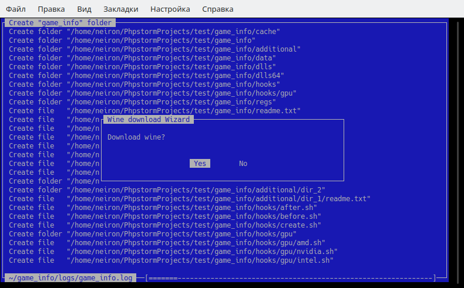
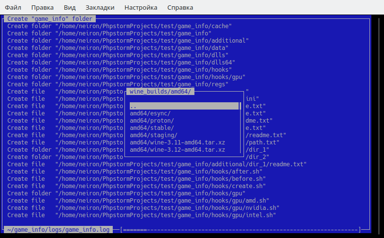
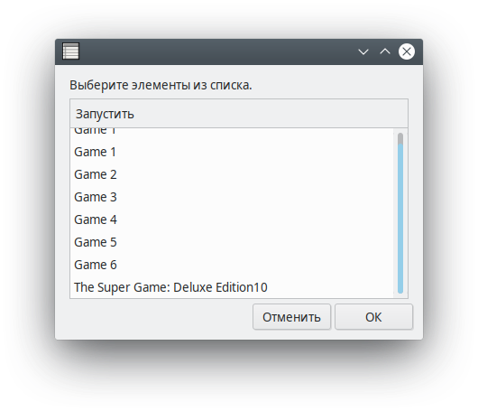

## Screenshots 








# Description 

- The application uses separate **wine** and **prefix** when porting.  
- **DXVK**, **winetricks** packages and **wine** assembly are downloaded automatically.  
- The application can compress data in **squashfs** to save space.

### Requirements

- **Operating system:** Linux
- **Architecture:** x86_64

### Requirements DirectX 11

- Graphics card must support vulkan.
- Drivers:
    - AMD driver:  
        - AMD RADV, Mesa 18.3 or newer (recommended)
        - AMDGPU PRO 18.50 or newer
    - NVIDIA driver:  
        - 415.22 or newer
    - INTEL driver:  
        - Mesa 18.3 or newer
- Wine:
    - 3.19 or newer

## How to run the game

1) Extract 
    ```bash
    chmod +x ./extract.sh && ./extract.sh
    ```
2) Start the game
    ```bash
    ./start
    ``` 
    Or go to configuration mode
    ```bash
    ./start gui
    ```

## How to port the game

1) Create an empty folder

2) Run:
    ```bash
    wget -q -O start https://raw.githubusercontent.com/hitman249/wine-helpers/master/start && chmod +x start./start
    ```
    ```bash
    ./start
    ```

3) Follow the wizard instructions to download the **wine** and wait for the menu. Exit application.

4) Edit the file according to the game information.
    ```text
    ./game_info/game_info.ini
    ```

5) Run the configurator. Through the file manager install the game.
    ```bash
    ./start gui
    ```
    ```text
    Wine > File Manager
    ```
6) Game files should be in the folder: 
    ```text
    ./game_info/data
    ```

7) Additional `*.dll` libraries can be copied to folders:
    ```text
    ./game_info/dlls
    ./game_info/dlls64
    ```
    
8) Additional `*.reg` files can be copied to folder:
    ```text
    ./game_info/regs
    ```

9) Use the configuration file `winetricks_to_install = ""` parameter to install additional packages. Or use the command: 
    ```bash
    ./start winetricks
    ```

10) To use dxvk, use the `dxvk = 1` parameter in the configuration file.

11) To forward additional folders in prefix, use the following directory:
    ```text
    ./game_info/additional
    ```

12) Delete the `prefix` folder. 

13) The start team must successfully launch the game.
    ```bash
    ./start
    ```

14) The game has been successfully ported.


#### Recommendations

* Games recommended to put in the folder:
    ```text
    C:/Games/
    ```

### Using squashfs

*  Compress `./wine`
    ```bash
    ./start gui
    ```
    ```bash
    Tools > Pack > wine
    ```
    ```bash
    rm -rf ./wine
    ```

*  Compress `./game_info/data`
    ```bash
    ./start gui
    ```
    ```bash
    Tools > Pack > data
    ```
    ```bash
    rm -rf ./game_info/data
    ```


# Help

```text
Help:
./start             - Run game.
./start gui         - Graphical user interface.
./start kill        - Kill this instance Wine.
./start winetricks  - Winetricks install d3dx9 (./start winetricks d3dx9).
./start wine        - Get Wine Instance.
./start help
```

 ## Links
 
 * dxvk [GPU driver support](https://github.com/doitsujin/dxvk/wiki/Driver-support)
 * dxvk [releases](https://github.com/doitsujin/dxvk/releases)
 * wine builds for support vulkan [yandex disk](https://yadi.sk/d/IrofgqFSqHsPu) 
 or [google disk](https://drive.google.com/open?id=1fTfJQhQSzlEkY-j3g0H6p4lwmQayUNSR)
 * [wine standalone](https://lutris.net/files/runners/)
 * [Installer Repacks](https://repacks.net/)
 * Gamepad [dumbxinputemu](https://github.com/kozec/dumbxinputemu/releases)
 * Vulkan [vulkan.lunarg.com](https://vulkan.lunarg.com/sdk/home#linux)
 * [Wine + Gallium Nine](https://launchpad.net/~commendsarnex/+archive/ubuntu/winedri3)
 * [Управление тактовой частотой процессора под Linux](http://www.michurin.net/tools/cpu-frequency.html)
 * [Nightly builds dxvk](https://haagch.frickel.club/files/dxvk/)
 * [Performance Tweaks](https://github.com/lutris/lutris/wiki/Performance-Tweaks)